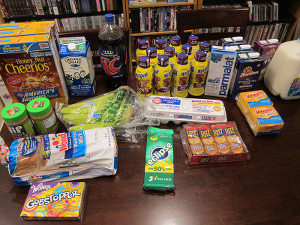

class: middle, center

Project Lighthouse

David Teller (Yoric)

---

class:middle

- ~285 millions vision-impaired people over the world (~20 millions in the US)
- 90% live in low-income

Can we help them?

---

# Problem: Identifying items

- **Groceries**
- Medications
- Clothes

.center[]

---

class: center, middle

# Demo time

---

# Current status

- Team: 1 UX, 2 devs, 2 EPM, 2 EM
- User Testing: ~25 users
- Competition: either $1000+ or requires a smartphone
- Prototype cost: ~$80
- Industrial cost estimate: ~$50 including S&H

---

# What's next?

## Userbase
- Alzheimer's patients

## Uses
- OCR
- Recognizing logos
- Connecting with Volunteers
- Deep Learning?
